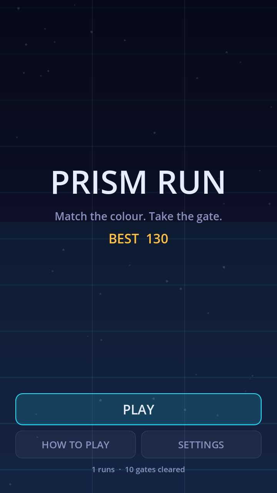
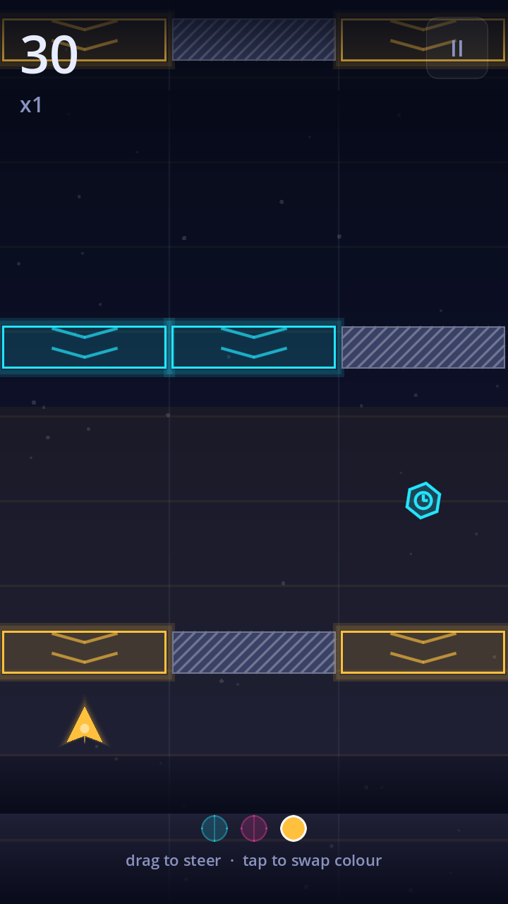
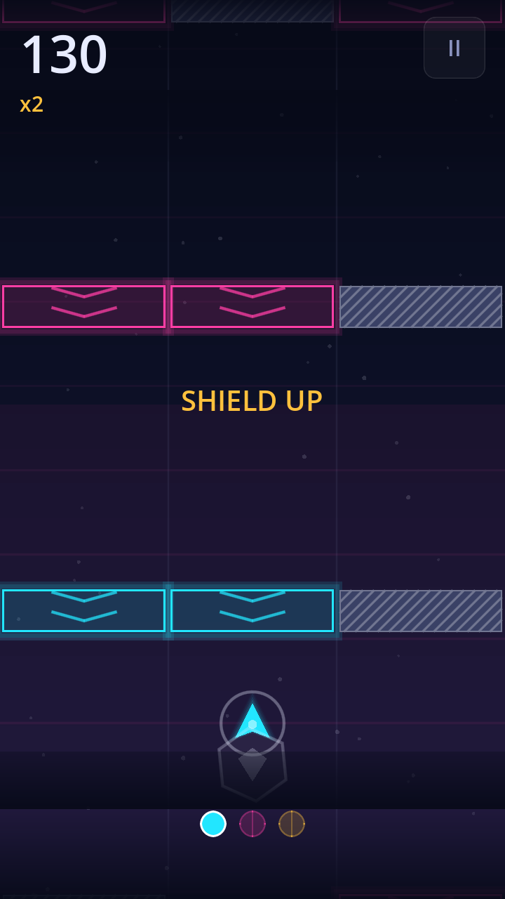
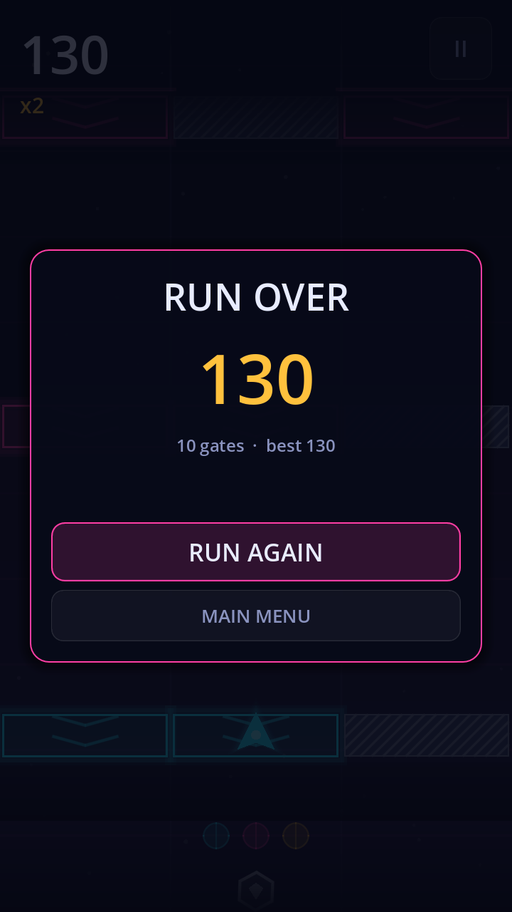

# Prism Run

A complete, shippable portrait arcade game for phones, built on Godot 4 with
GDScript. One thumb, three lanes, three colours: a gate only lets you through
where its colour matches your ship.

| Menu | Run | Later, faster | Summary |
| --- | --- | --- | --- |
|  |  |  |  |

## What is here

A full game loop, not a prototype: title screen with records, rules card,
settings, in-run HUD, pause, game over, persistent profile, power-ups, a
difficulty curve, haptics, procedural audio and a signed Android build.

- **Controls.** Drag anywhere to slide between lanes. Tap to cycle cyan →
  magenta → amber. Keyboard (arrows, space) works too, for desktop testing.
- **Gates.** Coloured cells are passable only while carrying that colour. Grey
  walls never are. Early gates leave two openings and mark everything else as
  an obvious wall; later ones leave one opening and disguise the rest as decoy
  colours.
- **Power-ups.** Shield absorbs one crash, slow-mo drops the scroll speed for
  four seconds, prism matches every colour for five, energy pays out score.
- **Scoring.** Ten points a gate, multiplied every eight consecutive clears up
  to eight times. A crash resets the multiplier.
- **Settings.** Music, sound, vibration and a reduced-effects mode that drops
  trails, grid and glow layers for older phones.

Zero binary game assets. Every sound is synthesised into an `AudioStreamWAV` at
boot, and every visual is drawn from code, so the download stays small and the
art scales to any screen density.

## Run it

Open the folder in Godot 4.4 or newer and press play, or from a terminal:

```bash
godot --path . # add --headless for a no-window boot check
```

The project also runs unmodified on a Godot build made from source: it was
verified against a 4.8-dev editor compiled from the `godotengine/godot` tree.

## Build the APK

```bash
tools/build_android.sh            # debug APK into build/
tools/build_android.sh release    # release APK, see the script header for env vars
```

Requirements, the same ones the Godot editor asks for:

1. Godot 4.4 (or match `GODOT_VERSION` in the CI workflow).
2. Android export templates for that exact Godot version.
3. An Android SDK with `platform-tools` and `build-tools`, its path set under
   **Editor → Editor Settings → Export → Android**, plus a JDK 17.
4. A keystore. The debug one is generated for you by the workflow; for a
   release build supply your own.

To build it in CI instead, copy `ci/build-android.yml` to
`.github/workflows/build-android.yml`. The job installs Godot, the export
templates and the SDK, runs the smoke test, exports, verifies the signature and
uploads the APK as an artifact. Add the `ANDROID_KEYSTORE_BASE64`,
`ANDROID_KEYSTORE_USER` and `ANDROID_KEYSTORE_PASSWORD` secrets to get a signed
release build instead of a debug one.

## Tests

```bash
godot --headless --path . tests/smoke.tscn     # gameplay loop
godot --headless --path . tests/ui_test.tscn   # every screen and button
python3 tools/check_apk.py build/PrismRun.apk  # after an export
```

All three exit non-zero on failure. The smoke test boots the gameplay scene and
drives it with an autopilot that reads the incoming gates, so spawning, the
difficulty ramp, collisions and scoring are exercised without a device. The UI
test walks every screen, presses every button and feeds real touch and key
events into a live run. `tools/check_apk.py` inspects the exported package.
`tools/screenshot.tscn` renders the PNGs above under a real renderer.

### One pitfall worth knowing

Godot 4.4's Android runtime calls `Vibrator.vibrate()` without catching
`SecurityException`, and its internal permission check returns true for VIBRATE
even when the manifest does not declare it, because VIBRATE is a normal rather
than a dangerous permission. An APK exported without `permissions/vibrate=true`
therefore dies the first time the player taps. Newer Godot builds catch it. The
preset here sets the flag and `tools/check_apk.py` fails the build if it is ever
dropped.

## Layout

```
project.godot          Portrait 720x1280, GL Compatibility renderer, autoloads
export_presets.cfg     Android APK, Android AAB and iOS presets
scenes/                main, game, player, barrier, pickup + the five UI screens
scripts/
  main.gd              Screen flow, Android back gesture, focus loss, notch insets
  game.gd              Spawning, difficulty, input, scoring, collisions
  player.gd            Ship: lanes, colours, shield, prism, trail
  barrier.gd           One falling gate row
  pickup.gd            Collectible tokens
  background.gd        Parallax gradient, grid and motes
  audio.gd             Procedural SFX and the music loop
  save_data.gd         Persistent profile and settings
  palette.gd           Colour language
  neon.gd              Stacked-draw glow that works on GL Compatibility
  track.gd             Lane geometry
  ui_kit.gd            Button, panel and label styling
tools/                 Icon generator, screenshot harness, build script
tests/smoke.gd         Headless autopilot test
ci/build-android.yml   GitHub Actions build
```

## Design notes

**Collisions are resolved analytically, not with physics bodies.** Each gate is
checked exactly once, on the frame its centre crosses the ship line, and the
check uses the ship's drawn position rather than its target lane so a late
swerve is a real miss. The outcome is identical at 30 fps on a budget phone and
at 120 fps on a flagship.

**Reachability is enforced when the speed climbs.** Above 620 px/s the next
opening is constrained to within one lane of the previous one, so the ramp stays
hard but never unfair.

**The renderer is GL Compatibility**, which covers the widest range of Android
devices. Glow is faked with stacked translucent draws instead of a post-process,
so it costs a handful of quads and needs no framebuffer effects.

**Phone integration is wired up**: the Android back gesture pauses a run and
steps back through the screens, losing focus auto-pauses, the HUD is inset from
notches and gesture bars using the reported display safe area, and vibration is
short and optional.

## Notes

- The Android preset ships `arm64-v8a` and `armeabi-v7a`. Enable `x86_64` in
  `export_presets.cfg` if you want it to run on an emulator.
- `package/unique_name` is `com.prismrun.game`. Change it before publishing.
- Icons are generated by `tools/make_icons.py` (needs `pillow`) so the launcher
  art stays in sync with `icon.svg`.
